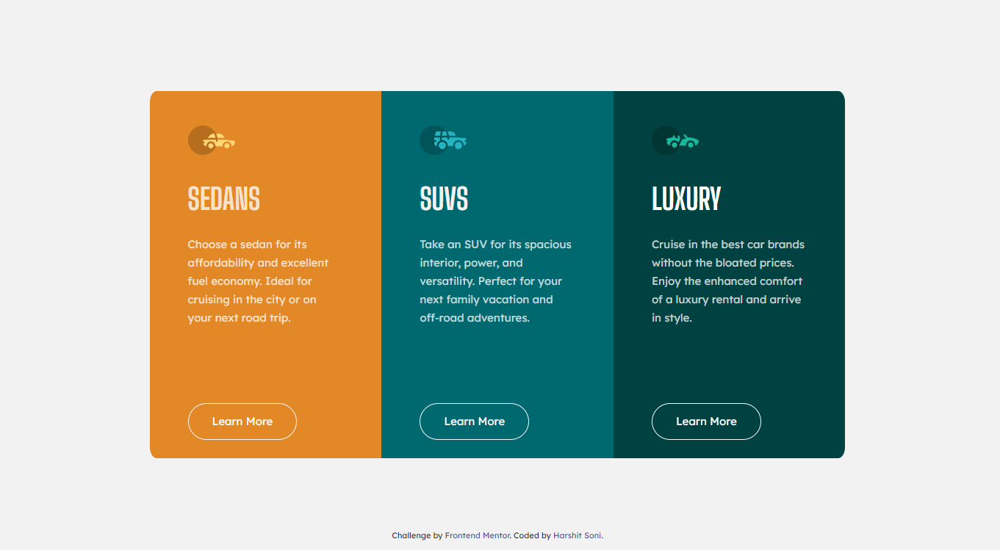

# Frontend Mentor - 3-column preview card component solution

This is a solution to the [3-column preview card component challenge on Frontend Mentor](https://www.frontendmentor.io/challenges/3column-preview-card-component-pH92eAR2-). Frontend Mentor challenges help you improve your coding skills by building realistic projects.

## Table of contents

- [Overview](#overview)
  - [The challenge](#the-challenge)
  - [Screenshot](#screenshot)
  - [Links](#links)
- [My process](#my-process)
  - [Built with](#built-with)
  - [Continued development](#continued-development)
  - [Useful resources](#useful-resources)
- [Author](#author)

## Overview

### The challenge

Users should be able to:

- View the optimal layout depending on their device's screen size
- See hover states for interactive elements

### Screenshot

### Links

- [Solution URL](https://your-solution-url.com)
- [Live Site URL](https://your-live-site-url.com)

## My process

### Built with

- Semantic HTML5 markup
- CSS custom properties
- Flexbox
- CSS Grid
- Mobile-first workflow
- [Styled Components]https://cdn.jsdelivr.net/npm/bootstrap@4.6.0/dist/css/bootstrap.min.css) - For styles

### Continued development

I will continue practicing flexbox and grid projects. These are very useful while stylizing a webpage.

### Useful resources

- [Flexbox guide](https://css-tricks.com/snippets/css/a-guide-to-flexbox/) - This really helped me while making the layout on screen.

## Author

- Frontend Mentor - [@Harshitsoni2000](https://www.frontendmentor.io/profile/Harshitsoni2000)
- GitHub - [@Harshitsoni2000](https://github.com/Harshitsoni2000)
